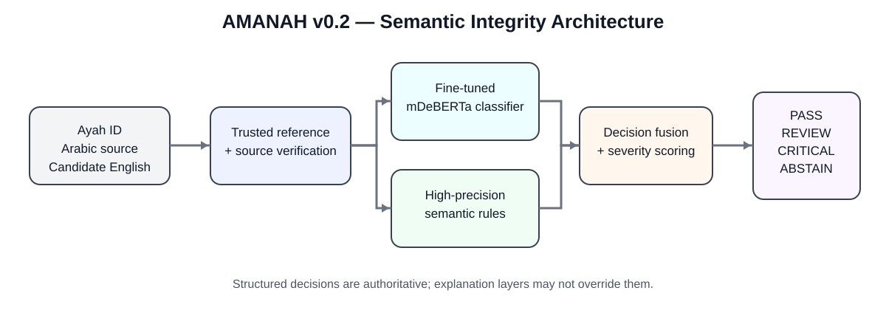
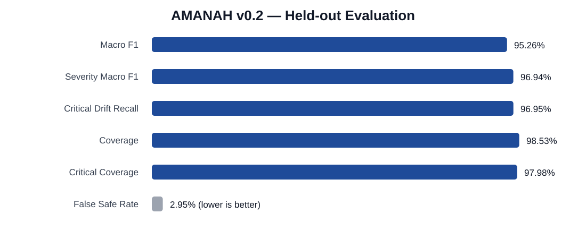
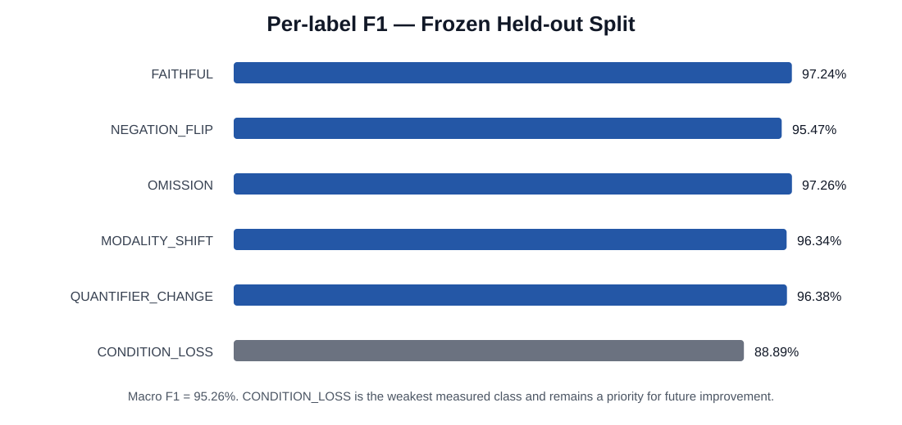
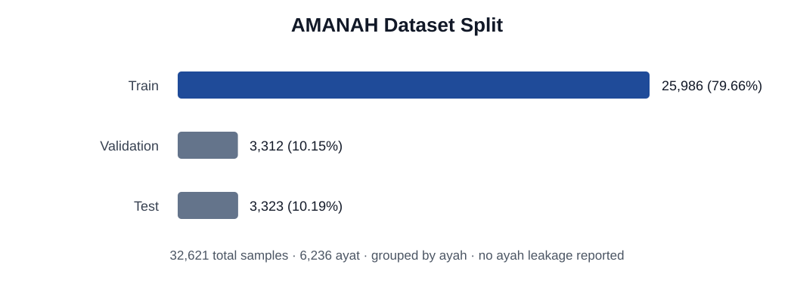

# Amanah AI model

## Semantic Integrity Engine for Qur'anic Translation

This directory contains the complete model-side implementation used for the AMANAH challenge release. It includes the semantic integrity classifier, trusted-reference layer, semantic safety rules, training/evaluation pipeline, regression tests, reproducibility notebooks, packaging/deployment code, measured results, and presentation-ready figures.

> **Validated focus:** Qur'anic Arabic → English translation integrity, with a documented retrieval/RAG expansion architecture for Hadith and Tafsir.



## 1. Release status

| Field | Value |
|---|---|
| Release | `amanah-semantic-integrity-v0.2` |
| Base model | `MoritzLaurer/mDeBERTa-v3-base-mnli-xnli` |
| Training signature | `74751fc19ce83158` |
| Canonical ayat represented | 6,236 |
| Total samples | 32,621 |
| Frozen test rows | 3,323 |
| Final black-box acceptance | PASS |
| Live endpoint release gates | PASS |
| CI / regression tests | Included under `tests/` |

## 2. Measured results



| Metric | Measured value |
|---|---:|
| Macro F1 | **95.2615%** |
| Severity Macro F1 | **96.9372%** |
| Critical Drift Recall | **96.9518%** |
| Coverage | **98.5254%** |
| Critical Coverage | **97.9769%** |
| False Safe Rate | **2.9499%** |



| Label | F1 |
|---|---:|
| FAITHFUL | 97.2373% |
| NEGATION_FLIP | 95.4689% |
| OMISSION | 97.2569% |
| MODALITY_SHIFT | 96.3351% |
| QUANTIFIER_CHANGE | 96.3821% |
| CONDITION_LOSS | 88.8889% |

**Evaluation context:** 95.26% is the measured **Macro F1** on the frozen held-out semantic-integrity benchmark.

Raw machine-readable values are available in:
- `results/metrics.json`
- `results/per_label_f1.csv`
- `docs/VALIDATION_RESULTS_V02.md`

## 3. What the system does

AMANAH accepts:
1. a canonical Arabic Qur'anic source,
2. an English candidate translation, and
3. an ayah identifier.

The runtime then:

1. resolves the trusted verse record;
2. verifies that the submitted Arabic matches the canonical source;
3. runs the fine-tuned multilingual classifier;
4. evaluates high-precision semantic rules against trusted English references;
5. fuses model and rule evidence;
6. returns a structured decision:
   - `PASS`
   - `REVIEW`
   - `CRITICAL`
   - `ABSTAIN`
7. fails closed when provenance, source matching, model availability, or context coverage is insufficient.

### Measured classifier labels

The measured checkpoint was trained/evaluated on:
- `FAITHFUL`
- `NEGATION_FLIP`
- `OMISSION`
- `MODALITY_SHIFT`
- `QUANTIFIER_CHANGE`
- `CONDITION_LOSS`

`AGENCY_SHIFT` is protected by a dedicated high-precision runtime semantic guard in the validated v0.2 pipeline.

## 4. Dataset and split discipline



The validated run reported:
- 32,621 total samples
- 25,986 training samples
- 3,312 validation samples
- 3,323 test samples
- 6,236 canonical ayat
- no ayah leakage across splits
- no canonical mismatches
- no unknown ayat

Splitting is grouped by ayah so samples derived from the same ayah do not leak across train/validation/test.

Faithful examples are built from trusted English reference translations. Controlled semantic mutations create labeled drift cases. Mutation generation and QA logic are in:
- `data/mutations.py`
- `data/validators.py`
- `scripts/prepare_amanah_sd.py`
- `scripts/qa_dataset.py`

## 5. Training configuration

The measured run used:

| Parameter | Value |
|---|---|
| Base checkpoint | `MoritzLaurer/mDeBERTa-v3-base-mnli-xnli` |
| Seed | 42 |
| Target epochs | 5 |
| Last completed epoch | 4 |
| Early stopping | true |
| Batch size | 4 |
| Gradient accumulation | 4 |
| Learning rate | 2e-5 |
| Maximum sequence length | 512 |
| Best validation loss | 0.1448546965718427 |

See `results/training_config.json` and `notebooks/model_training_v0_2.ipynb`.

## 6. Release gates and safety cases

The release process includes explicit regression checks for high-impact semantic cases.

### Qur'an 35:28 — agency reversal
Incorrect candidate:
```text
Only Allah fears the knowledgeable among His servants.
```

Validated runtime result:
- `CRITICAL`
- `S3`
- `AGENCY_SHIFT`
- human review required

Correct-direction candidate must not raise `AGENCY_SHIFT`.

### Qur'an 2:2 — semantic negation equivalence
A reviewed equivalence such as:
```text
no doubt  ↔  beyond doubt
```
must not be treated as a negation flip.

A true polarity change such as:
```text
This is not the Book...
```
must be detected as a critical negation change.

### Canonical source mismatch
If an Arabic input does not match the trusted canonical Arabic for the supplied ayah identifier, the runtime returns:
- `ABSTAIN`
- `reference_status = source_mismatch`
- human review required

See `results/release_gates.md` and the regression tests under `tests/`.

## 7. Repository structure

```text
Amanah AI model/
├── amanah_engine/        # inference, references, rules, scoring, service
├── api/                  # FastAPI wrapper
├── data/                 # schemas, mutation generation, split/validation logic
├── training/             # training, calibration, metrics, evaluation
├── scripts/              # source retrieval, dataset QA, HF packaging
├── deployment/           # Hugging Face custom handler / container assets
├── notebooks/            # training, validation, publishing, endpoint control
├── tests/                # unit, regression, API, data, training tests
├── sources/              # source manifest
├── examples/             # non-secret example payloads
├── results/              # measured metrics and release evidence
├── figures/              # presentation-ready SVG figures
└── docs/                 # protocol, architecture, provenance, security
```

## 8. Local setup

### Prerequisites
- Python 3.11+
- Git
- CPU is sufficient for unit tests and API contract tests
- GPU is recommended for retraining

### Install

```bash
cd "Amanah AI model"
python -m venv .venv
# Windows
.venv\Scripts\activate
# macOS/Linux
# source .venv/bin/activate

python -m pip install --upgrade pip
pip install -r requirements.txt
```

### Run the test suite

```bash
pytest -q
```

### Start the local API

The runtime requires a packaged checkpoint/reference store. Once a local model package is available:

```bash
uvicorn api.main:app --host 0.0.0.0 --port 8000
```

The exact local model path/configuration is described in `docs/REPRODUCIBILITY.md`.

## 9. Judge / reviewer model access

The packaged AMANAH v0.2 model is available on Hugging Face:

- **Model repository:** https://huggingface.co/SaharIsmail/semantic-integrity-v0-1
- **Validated revision:** https://huggingface.co/SaharIsmail/semantic-integrity-v0-1/tree/v0.2-validated
- **Revision name:** `v0.2-validated`

Reviewers can independently inspect, download, run, or deploy this package. **No team credential is stored in this repository.**

For authenticated Hugging Face testing, each reviewer should create and use a **personal Hugging Face access token from their own Hugging Face account**. The token must never be committed to Git, pasted into source files, or shared with the AMANAH team.

Two supported review paths are documented:

1. **Local reproducibility:** download the validated Hugging Face package and run the FastAPI wrapper from this repository.
2. **Hugging Face Inference Endpoint:** deploy the validated model revision under the reviewer's own Hugging Face account, then call it with the documented JSON contract.

Exact commands, environment variables, request examples, and expected response fields are in:

- **[docs/JUDGE_MODEL_QUICKSTART.md](docs/JUDGE_MODEL_QUICKSTART.md)**
- **[docs/API_REFERENCE.md](docs/API_REFERENCE.md)**

## 10. API contract

### Request

```json
{
  "inputs": {
    "source_type": "quran",
    "source_ar": "canonical Arabic ayah text",
    "candidate_en": "candidate English translation",
    "ayah_id": "35:28"
  }
}
```

### Response

```json
{
  "decision": "CRITICAL",
  "integrity_score": 55,
  "severity": "S3",
  "confidence": 0.995,
  "drifts": [
    {
      "label": "AGENCY_SHIFT",
      "severity": "S3",
      "confidence": 0.995,
      "origin": "rule"
    }
  ],
  "needs_human_review": true,
  "model_version": "amanah-semantic-integrity-v0.2",
  "reference_status": "verified",
  "notes": ["High-precision critical rule triggered."]
}
```

The web application must treat the structured AMANAH response as authoritative. An LLM may explain the result, but must not overwrite the decision, severity, integrity score, or review state.

## 11. Deployment and secrets

The repository contains **no production secrets**.

Expected secret/environment names are documented only as placeholders:

| Name | Purpose | Commit value? |
|---|---|---|
| `HF_TOKEN` | publishing/updating protected HF assets | **No** |
| `AMANAH_ML_URL` | server-side endpoint URL | placeholder only |
| `AMANAH_ML_TOKEN` | server-side endpoint authorization | **No** |

Use Colab Secrets, GitHub Actions secrets, Cloudflare secrets, or equivalent platform secret stores.

Deployment flow:
1. train/evaluate checkpoint;
2. package validated runtime;
3. publish to the existing model repository revision;
4. update the existing inference endpoint;
5. run live release gates;
6. scale to zero when idle if supported by the hosting plan.

Relevant notebooks:
- `notebooks/model_training_v0_2.ipynb`
- `notebooks/publish_v0_2_from_drive_cpu.ipynb`
- `notebooks/update_existing_endpoint_v0_2_validated_cpu.ipynb`

## 12. Source provenance

Source provenance is versioned and traceable. Challenge-aligned source governance and approved-source integration are documented in:
- `sources/official_source_manifest_v02.json`
- `docs/ISLAMIC_SOURCES_API_AR.md`
- `docs/SOURCE_PROVENANCE_AND_LICENSES.md`

The source layer is designed to preserve provider, version, checksum, and reference metadata for auditability.

## 13. Baselines and fair comparison

See `docs/BASELINE_COMPARISON.md`.

External-model comparisons follow the same frozen split, labels, thresholds, and metric definitions so results remain scientifically comparable. AMANAH's measured results are reported directly from its validated benchmark artifacts.

## 14. Further documentation

- `MODEL_CARD.md`
- `docs/ARCHITECTURE.md`
- `docs/REPRODUCIBILITY.md`
- `docs/EVALUATION_PROTOCOL.md`
- `docs/VALIDATION_RESULTS_V02.md`
- `docs/BASELINE_COMPARISON.md`
- `docs/SECURITY.md`
- `docs/PRESENTATION_GUIDE.md`

---

**AMANAH v0.2 — measured, reproducible, source-aware semantic integrity analysis.**
